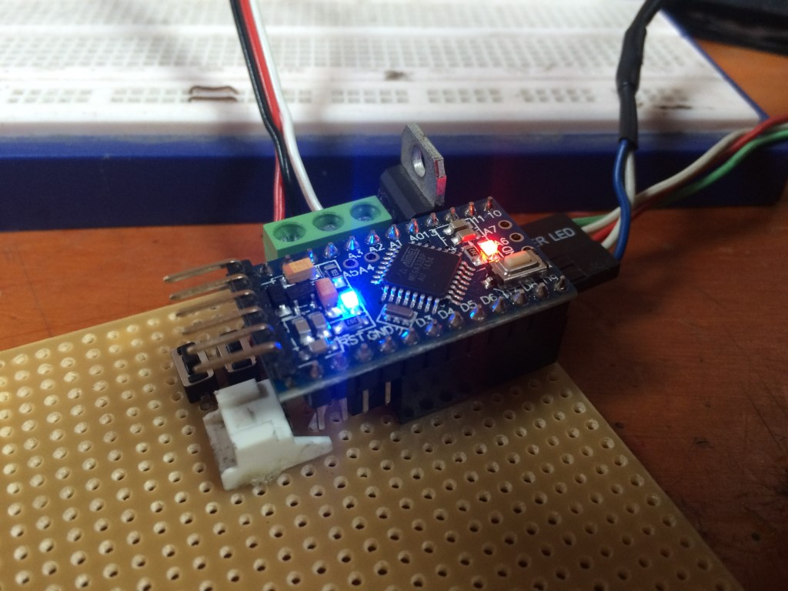
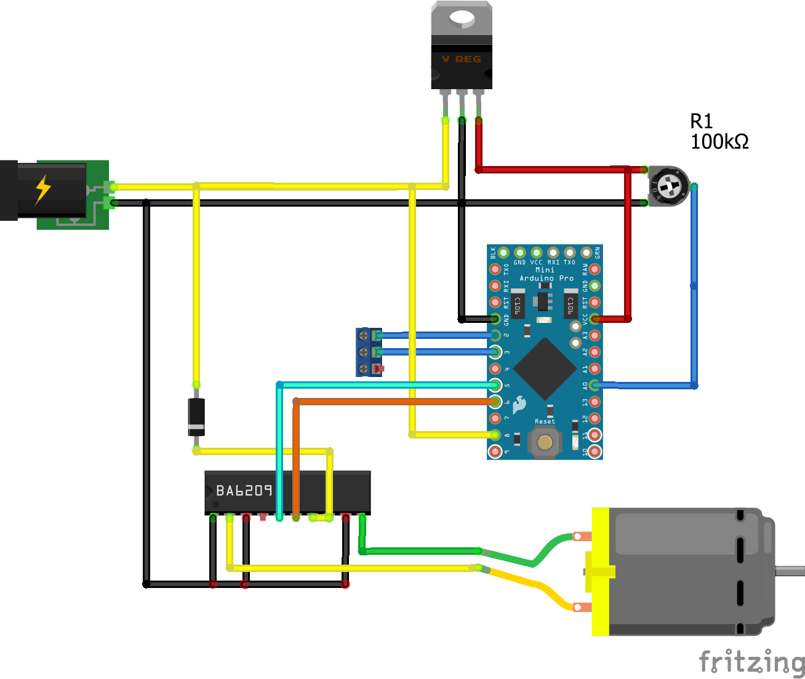

Navi
====
Controls the motor and sensor of the stock navigation display on the 2001 to 2008 Mazda 6. Replacing the stock screen controller functionality with a customizable one using off the shelve parts.

This is useful if you want to use the stock navigation enclosure with a tablet and want to retain the same buttons and functionality of the original screen.

This code can also be used to control RX-8's navigation screen as well. (modify thresholds for open, closed and tilted positions accordingly)

Demo
----

Schematic
---------
Don't remember much about it, but here is the general idea:

* 2 pushbuttons attached from pin 2 and 3 to GND (use existing buttons on Mazda 6 input screen / RX-8 buttons)
* 1 BA6209 H-Bridge for controlling the motor with its inputs attached to pin 4 and 5.
* 1 Potentiometer to control position. (included in stock nav enclosure) conected to analog pin 0
* 1 Motor (included in stock nav enclosure attached to output of H-Bridge)
* 12v and Ignition should be wired in as well, the idea is that when the car turns off the ignition voltage drops to 0 telling the arduino to initiate the close operation.

Changelog
----------

1 January 2021
* Edited README

24 October 2014
* Refactored code to remove redundant calls. 
* Split into various files to improve readability.

22 March 2014
* Initial version.

Todo
----

#### Update: 1/6/2021

It's been a long time...
Unfortunately I wasn't able to continue working on this project. I have since moved abroad and unfortunately had to sell my car. 

I'll leave this project here in hopes somebody else is interested in thinkering with their Mazdas. There is a "fullish" write up in my [blog](https://blog.alejandro.md/2014/09/01/in-car-tablet-install-part-1/).

#### Update: 10/24/2014

I'm pleased to report the code has been working great so far. I've been using it for months already without running into issues.

Although, I have learned from experience that a better circuit needs to be made to avoid wasting power. With that in mind, implementing the arduino sleep functionality into the might be my next step. In hopes of reducing idle power consumption.

Through testing I have discovered it uses about ~90mA while powered on. Seems like nothing, but considering that the car alone uses about ~40mA while turned off, its something to keep in mind while storing your car for longer periods of time.

Happy driving!
